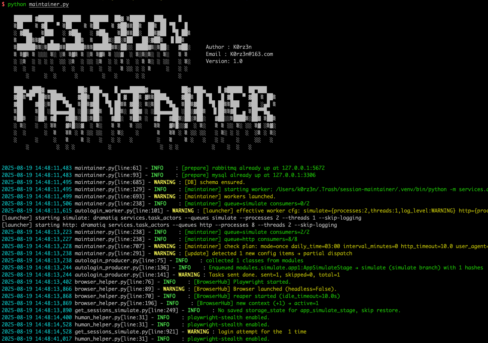

# Session-Maintainer





**Session-Maintainer** is a highly configurable automation tool that supports automatic acquisition of website sessions through Chrome and API requests, persistence based on MySQL, and can be automatically maintained and updated. It can serve as a cornerstone for security scanning and automated verification.

The project's prototype is the login state maintenance module of a scanner, whose **operation mode has been refined and validated through long-term practical use**. It has now been reorganized and restructured for open-source sharing.

**The advantages of this project are:**

- **Multiple modes**: Support WEB browser simulation and interface request two modes to obtain website cookies/tokens
- **Multiple sources**: Supports extracting specified keys and values from urls, headers, cookies, body and other locations of data packets
- **Persistible**: Supports persistence of sessions using database
- **Automatic update**: Supports configuring multiple update mechanisms such as single time, timing and period, and automatically check the validity of persistent login states and update it
- **Highly customized**: Supports extracting different session tokens (SSO scenarios) that appear in the same application, and also supports any non-token but need to be passed during requests using kv values
- **Machine verification Bypass**: Supports human front-end simulation login, bypassing dynamic anti-human-machine nuclear mechanisms such as sliding verification codes
- **Asynchronous task**: Supports the number of processes to configure the message queue to achieve multi-process parallelism, and uses two queues: simulate and http, and parallel execution significantly improves efficiency
- **Quick login**:For the simulate mode, cookies/localstorage and other data will be cached locally. When logging in again, it will quickly restore the data and directly check the validity to avoid having to enter the account and password every time.


## Installation

```
This project has only been tested in Mac M1 environments. There may be problems with Windows and Linux, python >= 3.12
``` 

### System dependencies installation 

This project needs to depend on system-level software such as [chrome](https://www.google.com/chrome/), [mysql](https://www.mysql.com/), [playwright](https://playwright.dev/), [rabbitmq](https://www.rabbitmq.com/), etc. Please search for the installation method yourself.

```
1. rabbitmq: Message queue, used to accept tasks, currently only supports installation locally, and uses default password
2. mysql: database, used for session persistence, you can configure your account password in ./configs/config.py
3. playwright: An automated framework, used to invoke Chrome for login action recording
4. Chrome: Browser, used to perform simulated login in simulated mode, and obtain session
```

### Project dependencies installation

```
# Create a python virtual environment
python3 -m venv .venv

# Activate the ython virtual environment
source .venv/bin/activate

# Install project dependencies
pip install -r requirements.txt

# Install the browser that playwright is adapted to
python3 -m playwright install chromium
```


## Running

### Start the system service

```
# Start rabbitmq message middleware
rabbitmq-server

# Start MySQL service
brew services start mysql
```

### Configuration file editing

```
Please read the comments in configs/config.py to understand global configuration

Please read the example files in modules/simulate and modules/http to understand the configuration of the application
```

If you need to use simulate mode, please use the following command to record the login action, process the generated python code and put it into the login function in the template.

```
python -m playwright codegen --target python https://example.com/login
```

### Project start

```
python3 maintainer.py
```

### monitor

```
# Check the queue status
rabbitmqctl listqueues -p / name

# View messages for delayed queues
rabbitmqctl listqueues -p / name messages consumers

# Clean up the queue
rabbitmqadmin purge queue name=simulate

rabbitmqadmin purge queue name=http
```


## Key point explanation:


| **Parameter / Concept**   | **Description** |
|---------------------------|-----------------|
| **session_collection_url** | Core parameter, used for acquiring the session; participates in the generation of **session_hash** and **session_check_url**. |
| **session collection logic** | Match `session_collection_url` with the URL requested in the browser context. <br> - If **no query**, match is successful when `host + path` are identical. <br> - If **query exists**, the query key-value pairs in `session_collection_url` must be a **subset** of the requested URL's query. |
| **session_hash** | Computed as: `hash(application_name + normal(session_collection_url).lower())`. |
| **session_check_url** | Generated by `normal(session_collection_url)` **plus** concatenation of the query parameters captured from `session_list`. |
| **URL_NORMALIZER** | Defines the logic of the `normal` function. <br> - Custom rules are checked sequentially (top to bottom). <br> - A rule is considered matched when `host + path + query` all satisfy the condition, and then only the specified parameters are retained. <br> - If no rule matches, the default strategy applies: remove all query parameters and normalize the remaining part. |


## Todo List

- Support the recalculation of signature before the API interface verification request is initiated.

- Support verification code recognition and automatic filling

- Support the location and name of custom queues

- Supports Windows and Linux environments

- Detailed function introduction and usage documentation 


## Update history

- **2025-08-19(V1.1.0)**:
  - The configuration for URL_NORMALIZER  has been added in config.py, enabling support for scenarios where URL query parameters are used for service identification or routing in gateway/microservice environments. Users can now configure to enforce the retention of specified URL parameters in session_collection_url, which will be included as part of the session_hash calculation. These parameters will also be automatically appended to the URL used by the checker for verifying login status, a change from the previous logic where these parameters were cleared.
  - Optimized some error messages and reduced the output of the error stack.
  - Add key point explanation in README
